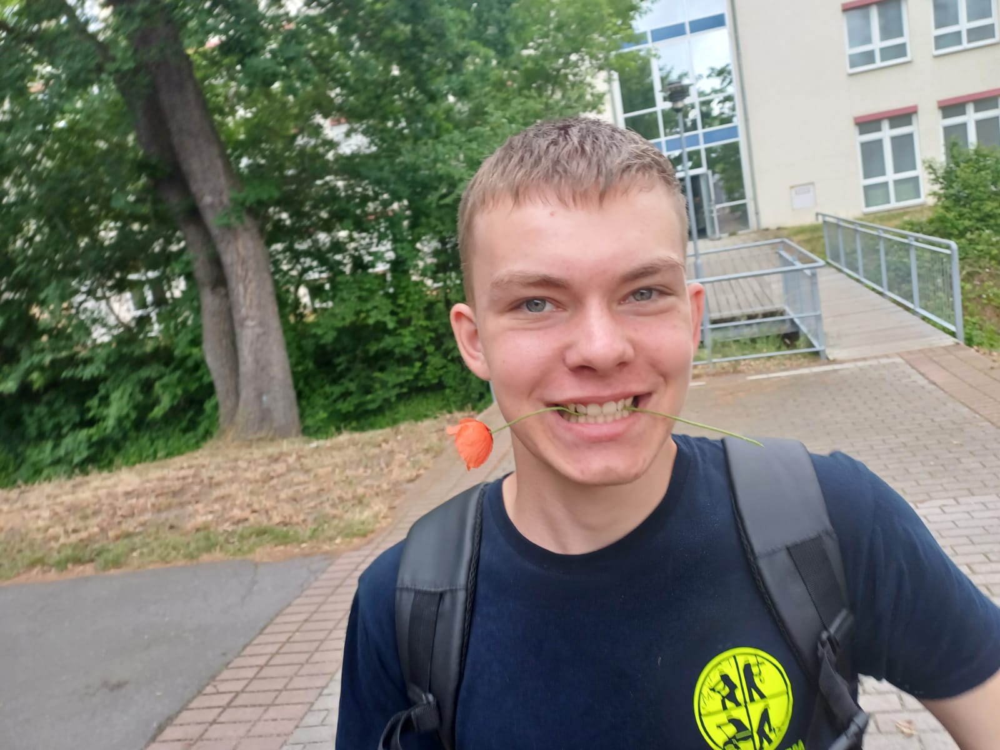

### Hi there 👋

### about me
I'm Jannick from Elsterwerda, Germany.
I'm almost(holidays) visiting 11th Grade on the Elsterschloss-Gymnasium Elsterwerda (Secondary School).
My hobbies are Hardware/Software and - as you can see in the Photo on my tee - Firefighters. in Brandenburg(my State) it's allowed to be a fireman at 16 years.
In school I chose intensified course in IT and English because i am somehow good at it and like to do them.
In first year of school-IT we started learning: programming (especially C++), logic, networks, and at the end we created databases

### My project(s)
[My Website](toxic-jannick.github.io): My github.io site for publishing my projects. There you can see all my projects i've been working on
<!--!
**toxic-jannick/toxic-jannick** is a ✨ _special_ ✨ repository because its `README.md` (this file) appears on your GitHub profile.

Here are some ideas to get you started:

- 🔭 I’m currently working on ...
- 🌱 I’m currently learning ...
- 👯 I’m looking to collaborate on ...
- 🤔 I’m looking for help with ...
- 💬 Ask me about ...
- 📫 How to reach me: ...
- 😄 Pronouns: ...!

- ⚡ Fun fact: ...
-->
